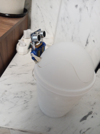
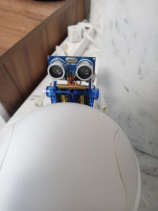
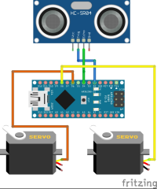

## Robotic urn on Arduino
---
Opens and smoothly closes the lid when two palms are placed 10-30 cm, the LED flickers when hands are detected at a distance of 30-50 cm.  

 

The original mechanism for lifting the lid is only screws servo and hot glue  

  

Arduino NANO, HC-SR04, SG-90 2 pcs  

   

Строка1 
 
Строка2  

